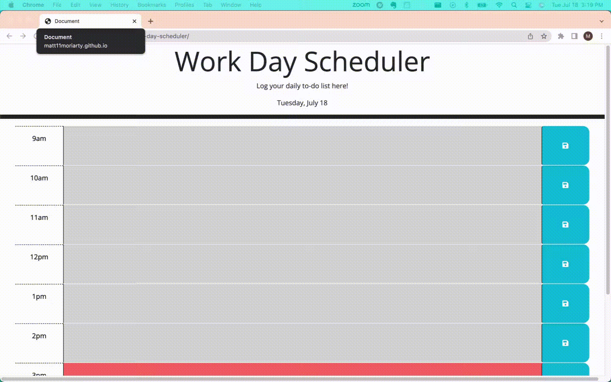

# Work Day Scheduler

## Description

This workday scheduler is a great way to plan out your day by the hour, and check off tasks as they are accomplished!

I created this application so that myself and my coworkers can timeblock their day, and keep track of what needs to get done each hour of the day.

In building this, I learned about the power of jquery, bootstrap, and other third-party api's like dayjs. Bootstrap is awesome, because it allowed me to borrow stying from their library, and without dayjs it would have been *extremely* difficult to dynamically change the row colors based on the time of day.

```
GIVEN I am using a daily planner to create a schedule
WHEN I open the planner
THEN the current day is displayed at the top of the calendar ✔️
WHEN I scroll down
THEN I am presented with time blocks for standard business hours of 9am to 5pm ✔️
WHEN I view the time blocks for that day
THEN each time block is color-coded to indicate whether it is in the past, present, or future ✔️
WHEN I click into a time block
THEN I can enter an event ✔️
WHEN I click the save button for that time block
THEN the text for that event is saved in local storage ✔️
WHEN I refresh the page
THEN the saved events persist ✔️
```

## Table of Contents (Optional)

- [Work Day Scheduler](#work-day-scheduler)
  - [Description](#description)
  - [Table of Contents (Optional)](#table-of-contents-optional)
  - [Installation](#installation)
  - [Usage](#usage)
  - [Credits](#credits)
  - [License](#license)
  - [Badges](#badges)
  - [Features](#features)
  - [How to Contribute](#how-to-contribute)
  - [Tests](#tests)

## Installation

N/A

## Usage

App URL: https://matt11moriarty.github.io/work-day-scheduler/

1. Add your tasks to the desired time block
2. Click save to store them to your computers local storage
3. With each passing hour, the color scheme will change
   1. Grey: In the past
   2. Red: Current hour
   3. Green: In the future
4. Today's date is displayed at the top (in case you forget)
5. If you would like to remove a saved task, simply clear out the field and hit the save button. 





## Credits

Resources:

1. Local storage: https://www.w3schools.com/jsref/prop_win_localstorage.asp
2. Adding a line break: https://www.w3schools.com/tags/tag_hr.asp
3. Dayjs: https://day.js.org/docs/en/parse/now
4. Bootstrap: https://getbootstrap.com/
5. Jquery: https://jquery.com/
6. Starter Code: https://github.com/coding-boot-camp/crispy-octo-meme
   
## License

N/A

## Badges

N/A

## Features

1. Displays current date
2. Highlights current hour
3. Save tasks to local storage by each hour

## How to Contribute

N/A

## Tests

N/A
